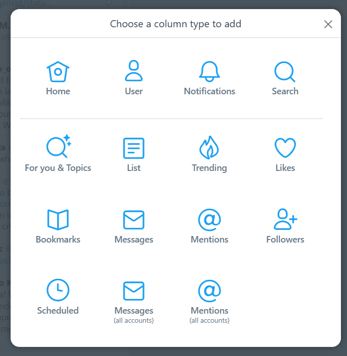
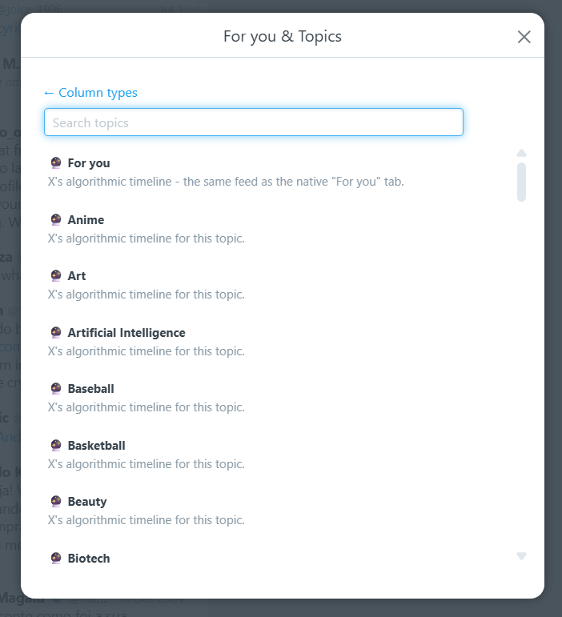
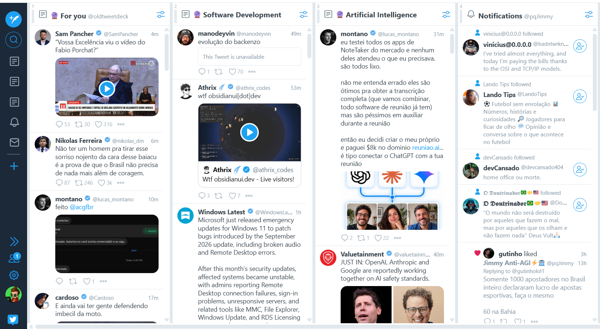

# TweetDeckV2

**Old TweetDeck, now with X's algorithmic timelines.**

TweetDeckV2 is a fork of [OldTweetDeck](https://github.com/dimdenGD/OldTweetDeck) by [dimden](https://github.com/dimdenGD). It keeps everything OldTweetDeck does — the classic TweetDeck interface running on `x.com/i/tweetdeck` — and adds something the original TweetDeck never had: columns for X's **recommended feeds**.

Classic TweetDeck columns are all reverse-chronological. With this fork you can also add the ranked **For you** feed and any of **70+ topic timelines** (Technology, AI, Soccer, Crypto, Anime, and more) as regular columns, side by side with your Home, Lists, Search and Notifications.

> [!NOTE]
> Since Twitter made likes private, the Likes tab no longer loads. This can't be fixed because the API that returned likes is gone. The same applies to the Activity column.

### Other languages

[한국어 README](docs/README_KO.md) · [日本語 README](docs/README_JA.md) — these describe the original OldTweetDeck and don't cover the features added in this fork.

---

## What's new in this fork

### 1. A new column type: **For you & Topics**

Open **Add column** and you'll find a new **For you & Topics** tile next to the classic column types.

### 2. Pick the For you feed or any topic

The tile opens a searchable picker. **For you** is the same ranked feed as the native "For you" tab on X. Below it is the full catalog of X's topic timelines — type a few letters to filter and click one to add it as a column.

### 3. Algorithmic columns next to your regular ones

Each algorithmic column behaves like any other TweetDeck column: infinite scroll, load more, and it stays in your layout across reloads. Here, **For you**, **Software Development** and **Artificial Intelligence** run next to a regular Notifications column.

### Available topics

Technology · Artificial Intelligence · Science · Software Development · Startups · Robotics · Space · Biotech · Stocks & Economy · Business & Finance · Personal Finance · Real Estate · Crypto · Politics · Elections · News · Crime · Sports · Soccer · NFL · Basketball · Baseball · Ice Hockey · Tennis · Golf · Boxing · MMA & Wrestling · Cricket · Rugby · Cycling · Formula 1 · Racing & Motorsports · Winter Sports · Olympics · Esports · Gaming · Anime · Movies & TV · Celebrities · Memes · Podcasts · Music · Pop · Rock · Hip Hop · Jazz · Country Music · Electronic Music · K-pop · J-pop · Concerts · Dance · Art · Digital Art · Design · Photography · Fashion · Beauty · Food & Drink · Travel · Cars · Motorcycles · Nature & Outdoors · Pets · Home & Garden · Shopping · Health & Fitness · Mental Health · Education · Careers · Dating & Relationships · Marriage & Family

### Other changes from upstream

- **Updates come from this fork.** The extension downloads its TweetDeck files from this repository instead of the upstream one, so the fork's features aren't overwritten on load.
- **Fix for tweets failing to parse.** X is moving user fields out of the `legacy` object in its API responses; tweets without it no longer break the Home and algorithmic timelines.

---

## How it works

OldTweetDeck runs the original TweetDeck web client and translates its legacy REST calls into X's current GraphQL API. This fork builds on that bridge without touching the vendored TweetDeck bundle:

- **For you** and every topic are served by X's `HomeTimeline` GraphQL query. A topic timeline is the same query with an extra `tag` variable holding the topic id.
- Each algorithmic feed is exposed to TweetDeck as a **synthetic list** with a reserved id, so it reuses TweetDeck's existing list-column plumbing (rendering, pagination, saving the layout).
- The **For you & Topics** tile and picker are added to TweetDeck's column-type modal at runtime.

All of it lives in [`src/interception.js`](src/interception.js). Development notes (in Portuguese) are in [FORYOU_FEATURE.md](FORYOU_FEATURE.md).

---

## Installation

Note: don't delete the extension files (the unpacked folder for Chromium, the zip file for Firefox) after installing.

To build the zip packages, run `npm install` and then `npm run build`. This creates `build/OldTweetDeckChrome.zip` and `build/OldTweetDeckFirefox.zip`.

### Chromium (Chrome, Edge, Opera, Brave, etc.)

1. Clone or download this repository. You can load the folder directly, or unzip `build/OldTweetDeckChrome.zip` if you built it.
2. Go to the extensions page (`chrome://extensions`).
3. Enable **Developer mode**.
4. Click **Load unpacked**.
5. Select the extension folder.
6. Go to https://x.com/i/tweetdeck.

If you also have OldTweetDeck from the upstream project installed, disable it — only one of them should be active.

### Firefox

#### Nightly / Developer Edition

1. Build `build/OldTweetDeckFirefox.zip` as described above.
2. Go to the Configuration Editor (`about:config`).
3. Set `xpinstall.signatures.required` to `false`.
4. Go to the add-ons page (`about:addons`).
5. Click **Install Add-on From File...**.
6. Select the zip file.
7. Go to https://x.com/i/tweetdeck.

#### Stable

**Using this extension on Firefox Stable is not recommended.**

1. Go to `about:debugging#/runtime/this-firefox`.
2. Click **Load Temporary Add-on** and select the zip file.
3. **An add-on installed this way is removed when the browser closes.**

### Safari

Not supported.

---

## Updating

TweetDeck's files are fetched from this repository each time the tab loads, so updates to them arrive automatically after a refresh — unless you've set `localStorage.OTDalwaysUseLocalFiles = '1'`, which makes the extension use the files bundled in your local copy instead.

Changes to the extension files themselves (such as `manifest.json` or `src/injection.js`) require reinstalling or reloading the extension.

---

## FAQ

#### The extension stopped working.

Try reinstalling the extension before opening an issue.

#### The For you or topic columns stopped loading.

X periodically rotates the internal ids of its GraphQL queries. When the `HomeTimeline` id changes, algorithmic columns stop loading until it's updated in [`src/interception.js`](src/interception.js). You may also be rate limited — see below.

#### Some column isn't loading.

You're being rate limited. Columns come back after a while.

#### "Link another account you own" doesn't work.

See [this comment](https://github.com/dimdenGD/OldTweetDeck/issues/259#issuecomment-2281786253) for a workaround.

#### The Likes tab isn't loading.

This can't be fixed. Since Twitter made likes private, the API that returned them is gone.

---

## Credits

TweetDeckV2 is built on **[OldTweetDeck](https://github.com/dimdenGD/OldTweetDeck) by [dimden](https://github.com/dimdenGD)**. Bringing the legacy TweetDeck client back and bridging it to X's modern API is entirely that project's work; this fork adds the algorithmic For you and topic timelines on top of it. Thanks as well to the OldTweetDeck contributors and translators.

If you'd like 2015–2018 Twitter back too, check out dimden's [OldTwitter](https://github.com/dimdenGD/OldTwitter).

## License

MIT, same as upstream. See [LICENSE](LICENSE). Original copyright © 2023 dimden.
